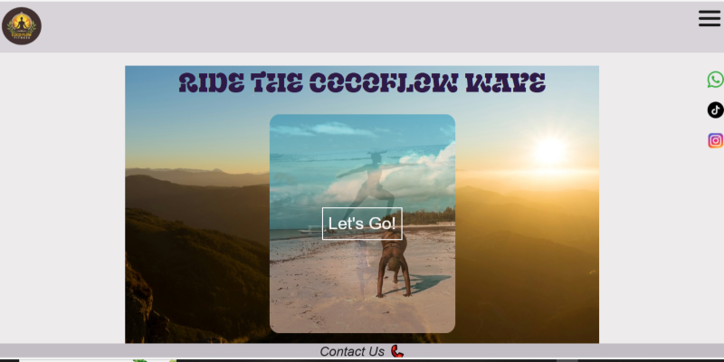
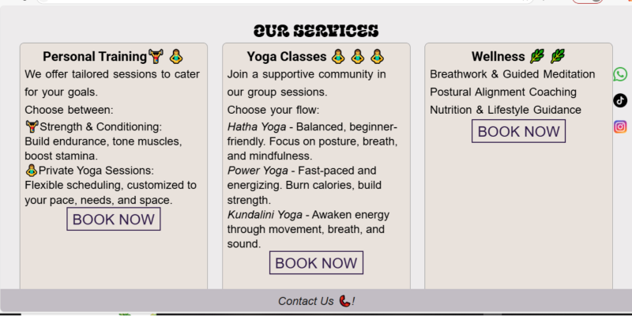
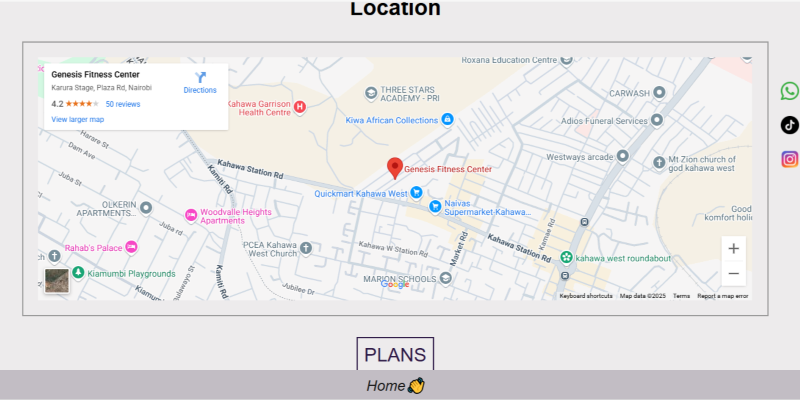

# Coco Flow Fitness 🌿

**Coco Flow Fitness** is a responsive yoga and wellness website that brings calm, clarity, and strength to your everyday life. Whether you're a beginner or an advanced yogi, our platform provides a digital sanctuary to practice, grow, and recharge — anytime, anywhere.

## 🌟 Overview

Coco Flow is built to promote physical fitness and mental wellness through yoga practices, calming aesthetics, and intuitive design. The site features yoga programs, inspirational content, Google Maps integration, client feedback, and clear call-to-actions to connect with your audience.

## 🧘‍♀️ Features

- 💠 Clean and calming interface with mobile responsiveness
- 📍 Google Maps integration for studio location
- 🎥 Client feedback video section
- 📲 Call-to-action buttons for user engagement
- ✨ About, Services, and Testimonials sections
- 🎨 Custom fonts and themed color palette for a yoga-friendly aesthetic

## 📁 Project Structure

```
COCO/
├── index.html          # Main landing page
├── services.html       # Service offerings page
├── contact.html        # Contact form and location map
---FAQS,html            # Frequentky Asked questions page
├── styles/
│   └── styles.css      # All custom styles
├── images/             # Logo and visual assets
--- videos/             # All video assets
└── README.md           # Project documentation
```

## 🛠️ Technologies Used

- HTML5 CSS3  & JAVASCRIPT
- Google Fonts & Font Awesome
- Google Maps Embed API
- Netlify (for hosting)
- Git & GitHub (for version control)

## 🚀 Getting Started

To run this project locally:

1. Clone this repo:

   ```bash
   git clone https://github.com/Mbuguambuthi/COCO.git
   cd COCO
   ```

2. Open `index.html` with your browser or use Live Server in VS Code.


No backend or build tools are required — it's a static frontend project.

## 🌐 Live Site

🔗 [Visit Coco Flow Fitness on Netlify](https://cocoflow.netlify.app )

## 📸 Screenshots

### 🖼 Homepage


### 🧘 Services Page


### 📍 Contact Page with Map


## 📨 Contact

Created with 💚 by **Mbugua Mbuthi**  
📧 Email: mbuguambuthi24@gmail.com  
🌍 Location: Kenya  
🔗 GitHub: [github.com/Mbuguambuthi](https://github.com/Mbuguambuthi)

---
Feel free to clone, customize, or contribute to this project. Namaste 🙏
